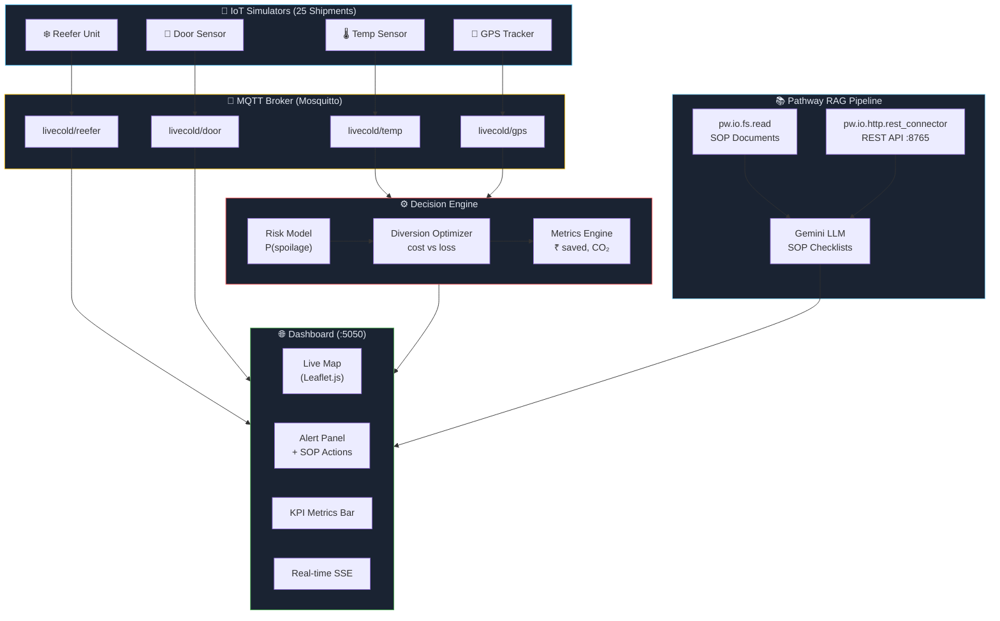
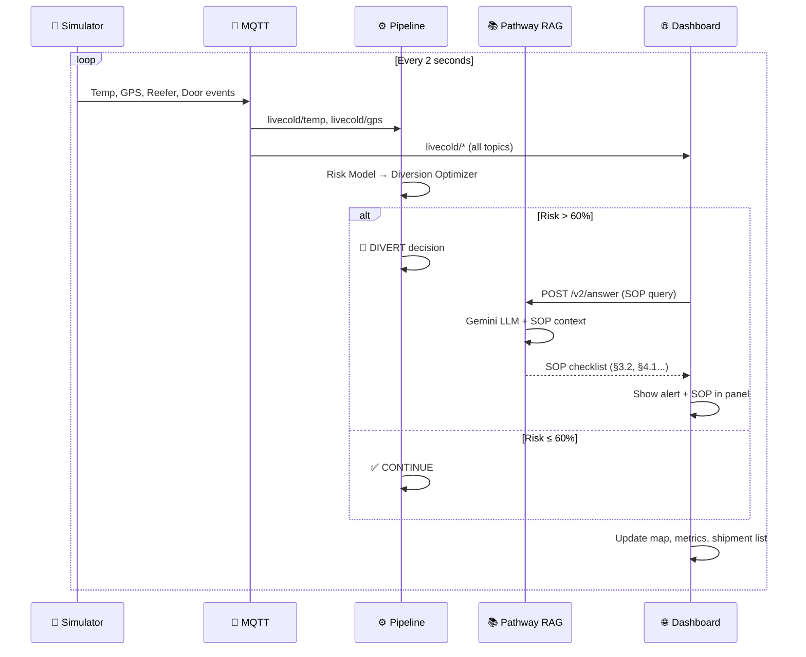

<div align="center">

# ❄️ LiveCold — Real-Time Cold Chain Intelligence Platform

**AI-powered cold chain monitoring, risk prediction, and autonomous diversion — built on [Pathway](https://pathway.com/) streaming framework.**

[](https://hub.docker.com/r/tarun1948/livecold)
[]()
[](https://pathway.com/)
[]()

</div>

---

## 🎯 Problem

India loses **₹63,000 crore/year** (~$7.5B) in perishable food waste during transit. Vaccines, dairy, seafood, and frozen goods require precise temperature control — yet most cold chain logistics rely on **manual monitoring** with **delayed reactions**.

**LiveCold** solves this with a **real-time streaming intelligence platform** that:
- 🌡️ Continuously monitors temperature, GPS, reefer status, and door events
- 🧠 Predicts spoilage risk using a cost-benefit decision engine
- 🚚 Autonomously recommends diversions when cargo is at risk
- 📋 Generates SOP-compliant action checklists using RAG + Gemini LLM

---

## 🏗️ System Architecture



---

## 🔄 Data Flow



---

## ✨ Key Features

| Feature | Technology | Description |
|---------|-----------|-------------|
| **Streaming RAG** | Pathway + Gemini | Live SOP document monitoring with LLM-powered Q&A |
| **Risk Prediction** | Custom ML model | Real-time P(spoilage) from temp deviation + exposure time |
| **Diversion Engine** | Cost optimizer | Automated divert/continue using `expected_loss vs diversion_cost` |
| **Live Dashboard** | Flask + Leaflet.js + SSE | Real-time map, alerts, KPIs with server-sent events |
| **Multi-stream IoT** | MQTT + Paho | 25 shipments × 4 sensor streams (temp, GPS, reefer, door) |
| **SOP Compliance** | RAG + Prompt Engineering | Auto-generated action checklists citing SOP §sections |
| **Metrics Tracking** | Pathway Tables | ₹ cargo saved, CO₂ delta, diversion rate, latency |

---

## 🚀 Quick Start

### Docker (Recommended)

```bash
# 1. Clone
git clone https://github.com/tarun1948/livecold.git
cd livecold

# 2. Create .env
echo "GOOGLE_API_KEY=your_gemini_key" > .env

# 3. Run
docker-compose up -d

# Dashboard: http://localhost:5050
# RAG API:   http://localhost:8765
```

### Local Development

```bash
# Prerequisites: Python 3.11, Mosquitto MQTT broker

# 1. Create virtual environment
python3.11 -m venv .venv-slim
source .venv-slim/bin/activate
pip install -r requirements-slim.txt

# 2. Start Mosquitto
mosquitto -c mosquitto.conf -d

# 3. Run all components
./replay.sh
# Or individually:
python main.py rag          # Pathway RAG (port 8765)
python main.py dashboard    # Dashboard (port 5050)
python main.py mqtt         # MQTT Decision Pipeline
python main.py sim-all      # All 4 simulators
```

---

## 📂 Project Structure

```
livecold/
├── main.py                      # Unified CLI entry point
├── pathway_rag_pipeline.py      # 📚 Pathway RAG (streaming SOP + REST API)
├── pathway_metrics_pipeline.py  # 📊 Pathway metrics aggregation
├── pathway_integrated_full.py   # 🔗 Full integrated Pathway pipeline
├── pathway_mqtt_bridge.py       # 🌉 Pathway ↔ MQTT bridge
│
├── dashboard/
│   ├── app.py                   # 🌐 Flask dashboard + MQTT subscriber
│   └── templates/index.html     # Live map, alerts, metrics UI
│
├── pipeline/
│   └── livecold_pipeline.py     # ⚙️ MQTT decision pipeline
│
├── decision_engine/
│   ├── evaluator.py             # Main intelligence entry point
│   ├── risk_model.py            # P(spoilage) calculator
│   ├── diversion_optimizer.py   # Cost-benefit diversion logic
│   └── metrics_engine.py        # System-wide metrics tracker
│
├── sim/
│   ├── temp_simulator.py        # 🌡️ Temperature sensor simulator
│   ├── gps_simulator.py         # 📍 GPS tracker simulator
│   ├── reefer_simulator.py      # ❄️ Reefer unit telemetry
│   ├── door_simulator.py        # 🚪 Door open/shock events
│   ├── shipment_factory.py      # Generates 25 diverse shipments
│   └── config.py                # Simulation parameters
│
├── watched_docs/
│   └── cold_chain_SOP.txt       # SOP document (indexed by RAG)
│
├── Dockerfile                   # Multi-component Docker image
├── docker-compose.yml           # Full stack with Mosquitto
├── docker-entrypoint.sh         # Starts all 5 components
├── replay.sh                    # Local demo launcher
├── requirements-slim.txt        # Python dependencies
└── mosquitto.conf               # MQTT broker config
```

---

## 🧠 Decision Engine Logic

```
┌─────────────────────────────────────────────────┐
│              SHIPMENT STATE INPUT                │
│  temp=12.5°C | safe_max=8°C | exposure=15min    │
│  cargo_value=₹8,00,000 | hub_dist=45km          │
└──────────────────┬──────────────────────────────┘
                   ▼
         ┌─────────────────┐
         │   RISK MODEL    │
         │  P(spoilage) =  │
         │  f(deviation,   │
         │    exposure,    │
         │    sensitivity) │
         │  → 0.85 (85%)   │
         └────────┬────────┘
                  ▼
    ┌──────────────────────────┐
    │   DIVERSION OPTIMIZER    │
    │                          │
    │  expected_loss = ₹6,80,000│
    │  diversion_cost = ₹3,600 │
    │  net_saving = ₹6,76,400  │
    │                          │
    │  → DIVERT ✅              │
    └──────────────────────────┘
```

---

## 📡 API Reference

### Pathway RAG — SOP Q&A

```bash
POST http://localhost:8765/v2/answer
Content-Type: application/json

{"prompt": "What to do if temperature exceeds threshold for dairy?"}
```

**Response:** SOP-compliant checklist citing §sections with action items.

### Dashboard APIs

| Endpoint | Method | Description |
|----------|--------|-------------|
| `/` | GET | Live dashboard UI |
| `/api/shipments` | GET | All active shipments with state |
| `/api/alerts` | GET | Recent alerts (last 50) |
| `/api/metrics` | GET | System-wide KPIs |
| `/api/stream` | GET | Server-Sent Events (real-time) |

---

## 🔧 Configuration

| Environment Variable | Default | Description |
|---------------------|---------|-------------|
| `GOOGLE_API_KEY` | — | Gemini API key (required for RAG) |
| `GOOGLE_API_KEY_2` | — | Backup API key (rate-limit rotation) |
| `MQTT_HOST` | `localhost` | MQTT broker hostname |
| `MQTT_PORT` | `1883` | MQTT broker port |

---

## 📊 Demo Metrics (25 shipments × 5 minutes)

| Metric | Value |
|--------|-------|
| Events Processed | 8,375+ |
| Cargo Value Monitored | ₹9.2 Billion |
| Cargo Value Saved | ₹1.86 Billion |
| Diversions Triggered | 2,115 (25.2%) |
| High-Risk Events | 2,119 |
| CO₂ Delta | 87,686 kg |

---

## 🛠️ Tech Stack

| Layer | Technology |
|-------|-----------|
| **Streaming Engine** | Pathway (tables, UDFs, connectors) |
| **LLM** | Google Gemini (via LiteLLM) |
| **Messaging** | MQTT (Eclipse Mosquitto) |
| **Dashboard** | Flask + Leaflet.js + SSE |
| **Embeddings** | Sentence-Transformers (local) |
| **Tokenizer** | tiktoken |
| **Containerization** | Docker + Docker Compose |

---

## 👥 Team

Built for the **Pathway Hackathon** — demonstrating real-time streaming AI for logistics.

---

## 📄 License

MIT
